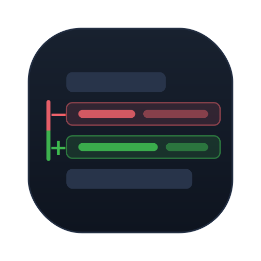
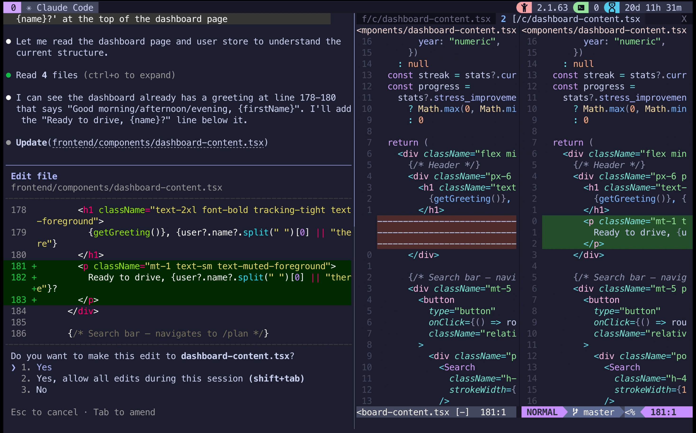

<div align="center">



# code-preview.nvim

**Review every edit your AI coding agent makes as a native Neovim diff — before it's written to disk.**

[](https://github.com/Cannon07/code-preview.nvim/actions/workflows/e2e-tests.yml)
[](https://github.com/Cannon07/code-preview.nvim/releases)
[](https://neovim.io)
[](LICENSE)

Works with **Claude Code**, **OpenCode**, **GitHub Copilot CLI**, and **OpenAI Codex CLI** — on **macOS, Linux, and Windows**.



</div>

---

## Demo


> Shown with Claude Code. OpenCode, GitHub Copilot CLI, and Codex CLI work the same way — expand **📺 More demos** below.

---

## Why

Your AI coding agent proposes edits in its terminal — a cramped, scroll-past diff you have to eyeball before typing `y`. **code-preview.nvim** intercepts that moment and opens the proposed change as a real Neovim diff: full syntax highlighting, your colorscheme, your keymaps. Review it like any other diff, then accept or reject in the agent's CLI as usual.

- 🔍 **See edits as native diffs** — side-by-side or GitHub-style inline, before anything touches disk
- 🤝 **Agent-agnostic** — Claude Code, OpenCode, Copilot CLI, Codex CLI, with more agents planned
- 🌳 **Neo-tree integration** — your file tree marks what's being modified, created, or deleted
- 🪶 **No Python** — file transforms run through `nvim --headless -l`; the only hard dep is Neovim 0.10+

<details>
<summary><b>📺 More demos</b></summary>

### OpenCode


### GitHub Copilot CLI


### OpenAI Codex CLI


### Neo-tree integration


</details>

---

## Install

With [lazy.nvim](https://github.com/folke/lazy.nvim):

```lua
{
  "Cannon07/code-preview.nvim",
  config = function()
    require("code-preview").setup()
  end,
}
```

<details>
<summary>Manual (path-based)</summary>

```lua
vim.opt.rtp:prepend("/path/to/code-preview.nvim")
require("code-preview").setup()
```

</details>

**Requirements:** Neovim >= 0.10. Each agent has a couple of extra needs — see below.

<details>
<summary>Per-agent requirements</summary>

| Agent | Needs |
|-------|-------|
| **Claude Code** | [Claude Code CLI](https://docs.anthropic.com/en/docs/claude-code) (with hooks) · [jq](https://jqlang.github.io/jq/) |
| **OpenCode** | [OpenCode](https://opencode.ai) (a version with plugin support) |
| **GitHub Copilot CLI** | [Copilot CLI](https://github.com/github/copilot-cli) (GA since Feb 2026) |
| **OpenAI Codex CLI** | [Codex CLI](https://github.com/openai/codex) recent enough for `apply_patch` PreToolUse hooks · [jq](https://jqlang.github.io/jq/) |

> On Windows, the Copilot CLI hook runs under PowerShell 7+ and needs no `jq`.

</details>

---

## Quick start

After `setup()`, the flow is the same for every agent:

1. Open your project in Neovim.
2. Install the agent's hooks (one command — pick your agent below) and **restart that agent's CLI**.
3. Ask the agent to edit a file — a diff preview opens automatically in Neovim.
4. Review it, then accept or reject in the agent. On accept, the preview closes automatically.

Then run the one install command for your agent (and apply any agent-specific config):

<details open>
<summary><b>Claude Code</b></summary>

`:CodePreviewInstallClaudeCodeHooks` — writes hooks to `.claude/settings.local.json`. No extra config needed.

> **Permissions:** by default the plugin forces a review prompt on every edit, so the preview always lines up with a real accept/reject moment — even if Claude Code is in bypass/allowlist mode. To instead let Claude Code's own permission settings decide, set `diff.defer_claude_permissions = true` (you'll then only see previews for edits Claude Code already stops to ask about).

</details>

<details>
<summary><b>OpenCode</b></summary>

`:CodePreviewInstallOpenCodeHooks` — copies the plugin to `.opencode/plugins/`.

Then enable permission prompts in `~/.config/opencode/opencode.json`:

```json
{ "permission": { "edit": "ask", "bash": "ask" } }
```

</details>

<details>
<summary><b>GitHub Copilot CLI</b></summary>

`:CodePreviewInstallCopilotCliHooks` — writes `.github/hooks/code-preview.json`. No extra config needed.

</details>

<details>
<summary><b>OpenAI Codex CLI</b></summary>

`:CodePreviewInstallCodexCliHooks` — writes `.codex/hooks.json`.

Codex must ask before applying edits, so set this in `.codex/config.toml` (or `~/.codex/config.toml`):

```toml
approval_policy = "on-request"
sandbox_mode    = "read-only"
```

Without it, Codex may apply changes without prompting and the preview never blocks on your decision. Hooks are enabled by default in modern Codex; if you previously set `[features] hooks = false` (or the legacy `codex_hooks = false`), remove it. Codex routes file edits through `apply_patch` — files created via shell redirection (`printf … > foo.txt`) aren't previewed.

</details>

> **Rejected a change?** The post-tool hook only fires on accept (and not at all on rejection for Claude Code & Copilot CLI), so press `<leader>dq` — or run `:CodePreviewCloseDiff` — to close the preview manually.

---

## Supported agents

Every agent is first-class — same diff experience, same keymaps, same neo-tree indicators.

| Agent | Install command | Mechanism |
|-------|-----------------|-----------|
| Claude Code | `:CodePreviewInstallClaudeCodeHooks` | shell hooks in `.claude/settings.local.json` |
| OpenCode | `:CodePreviewInstallOpenCodeHooks` | TS plugin in `.opencode/plugins/` |
| GitHub Copilot CLI | `:CodePreviewInstallCopilotCliHooks` | shell hooks in `.github/hooks/code-preview.json` |
| OpenAI Codex CLI | `:CodePreviewInstallCodexCliHooks` | shell hooks in `.codex/hooks.json` |

Each install command has a matching `:CodePreviewUninstall…` counterpart. More agents are planned.

---

## Configuration

`setup()` works with zero config. The most common knob is the diff **layout**:

```lua
require("code-preview").setup({
  diff = {
    layout = "tab",  -- "tab" | "vsplit" | "inline"
  },
})
```

| Layout | Description |
|--------|-------------|
| `"tab"` (default) | Side-by-side diff in a new tab — CURRENT left, PROPOSED right |
| `"vsplit"` | Side-by-side as a vertical split in the current tab |
| `"inline"` | GitHub-style unified diff in one buffer, syntax highlighting preserved, `]c` / `[c` to navigate |

You can also set the layout **per agent** — e.g. inline for Codex, a tab for everything else:

```lua
require("code-preview").setup({
  diff = {
    layout  = "tab",                 -- default for all agents
    layouts = { codex = "inline" },  -- keys: claudecode | opencode | copilot | codex
  },
})
```

### A fuller example

A realistic, opinionated lazy.nvim spec — inline diffs everywhere, a per-agent override, and neo-tree revealing from the git root:

```lua
{
  "Cannon07/code-preview.nvim",
  event = "VeryLazy",
  config = function()
    require("code-preview").setup({
      diff = {
        layout  = "inline",              -- unified GitHub-style diff (the strategic default)
        layouts = { opencode = "tab" },  -- override the layout per agent, to taste
      },
      neo_tree = { reveal_root = "git" }, -- reveal from the git root instead of cwd
    })
  end,
}
```

**Full option reference:** `:help code-preview-config` (or [`doc/code-preview.txt`](doc/code-preview.txt)) — every option, with the defaults kept in sync with the source.

<details>
<summary><b>Commands & keymaps</b></summary>

| Command | Description |
|---------|-------------|
| `:CodePreviewInstall…Hooks` / `:CodePreviewUninstall…Hooks` | Install/remove hooks for an agent (`ClaudeCode`, `OpenCode`, `CopilotCli`, `CodexCli`) |
| `:CodePreviewCloseDiff` | Manually close the diff (use after rejecting) |
| `:CodePreviewStatus` | Show socket path, hook status, and dependency check |
| `:CodePreviewToggleVisibleOnly` | Toggle `visible_only` — diffs only for open buffers |
| `:checkhealth code-preview` | Full health check (all agents) |

| Key | Scope | Description |
|-----|-------|-------------|
| `<leader>dq` | global | Close the diff (same as `:CodePreviewCloseDiff`) |
| `]c` | inline diff buffer | Jump to next change |
| `[c` | inline diff buffer | Jump to previous change |

See `:help code-preview-commands` and `:help code-preview-keymaps` for details.

</details>

---

## Neo-tree integration (optional)

If you use [neo-tree.nvim](https://github.com/nvim-neo-tree/neo-tree.nvim), code-preview decorates your file tree with indicators whenever changes are pending — no extra config, it works out of the box. If neo-tree isn't installed, nothing changes.

| Status | Icon | Color | Meaning |
|--------|------|-------|---------|
| Modified | 󰏫 | Orange | An existing file is being edited |
| Created | 󰎔 | Cyan + italic | A new file is being created (virtual node) |
| Deleted | 󰆴 | Red + strikethrough | A file is being deleted via `rm` |

Plus: auto-reveal of the changed file, virtual nodes for not-yet-created files, a temporarily clean focus (git status/diagnostics hidden while a change is pending), and auto-cleanup on accept/reject/`<leader>dq`. Symbols, colors, position, and reveal behavior are all configurable under the `neo_tree` table — see `:help code-preview-config`.

---

## How it works

```
AI Agent (terminal)                              Neovim
        |                                          |
   Proposes an Edit                                |
        |                                          |
   Hook/plugin fires ──→ compute diff ──→ RPC → show_diff()
        |                                          | (side-by-side or inline)
   CLI: "Accept? (y/n)"                       User reviews diff
        |                                          |
   User accepts/rejects                            |
        |                                          |
   Post hook fires ────→ cleanup ─────→ RPC → close_diff()
```

A hook fires before the edit is applied → Neovim shows the diff → a post-tool hook cleans up after you accept or reject. That's the whole loop, for every agent.

Curious about the internals — the per-OS hook entry, RPC transport, and per-agent adapters? See [CONTRIBUTING.md](CONTRIBUTING.md).

---

## Recommended companion settings

So buffers auto-reload after a file is written:

```lua
vim.o.autoread = true
vim.api.nvim_create_autocmd({ "FocusGained", "BufEnter", "CursorHold" }, {
  command = "checktime",
})
```

---

<details>
<summary><b>Troubleshooting</b></summary>

**Diff doesn't open**
- `:CodePreviewStatus` — check that `Neovim socket` is found
- `:checkhealth code-preview` — check for missing dependencies
- Enable `debug = true` and check `~/.local/state/nvim/code-preview.log`
- Restart the CLI agent after installing hooks (hooks are read at startup)

**Claude Code hooks not firing**
- Re-run `:CodePreviewInstallClaudeCodeHooks` in the project root
- Verify `.claude/settings.local.json` contains the hook entries; ensure `jq` is in PATH; restart the CLI

**OpenCode plugin not loading**
- Re-run `:CodePreviewInstallOpenCodeHooks`; verify `.opencode/plugins/index.ts` exists
- Ensure `"permission": { "edit": "ask" }` is set in `~/.config/opencode/opencode.json`; restart OpenCode

**Codex CLI hooks not firing**
- Re-run `:CodePreviewInstallCodexCliHooks`
- Confirm `.codex/config.toml` does **not** contain `[features] hooks = false` (or the legacy `codex_hooks = false`)
- Older Codex required `codex_hooks = true` and only fired hooks for `Bash`, not `apply_patch` — update if needed
- `:CodePreviewStatus` / `:checkhealth code-preview` report install state and the feature flag

**Copilot CLI hooks not firing**
- Re-run `:CodePreviewInstallCopilotCliHooks`; verify `.github/hooks/code-preview.json` exists
- Ensure `jq` is in PATH (macOS/Linux). On Windows, Copilot runs the hook under pwsh 7+ — if it silently doesn't fire, check `Get-ExecutionPolicy` (`RemoteSigned` works; `Restricted`/`AllSigned` blocks it)
- Restart Copilot CLI

**Diff doesn't close after rejecting**
- Press `<leader>dq` or run `:CodePreviewCloseDiff` — the post hook only fires on accept (Claude Code & Copilot CLI)

**Migrating from older versions**
- Update `require("claude-preview")` → `require("code-preview")` in your config
- Re-run `:CodePreviewInstallClaudeCodeHooks` to update hook paths
- The old `:ClaudePreview*` commands were removed — use the `:CodePreview*` equivalents

</details>

---

## Contributing

Architecture, internals, and how to run the tests live in [CONTRIBUTING.md](CONTRIBUTING.md). The project's vocabulary is defined in [CONTEXT.md](CONTEXT.md).

## License

MIT — see [LICENSE](LICENSE).
